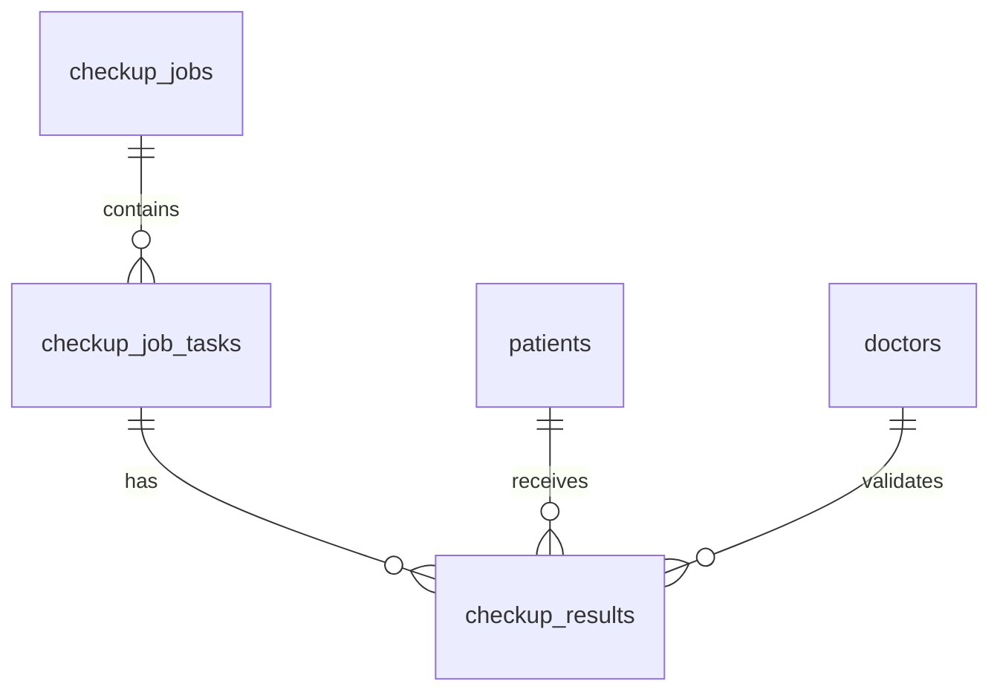
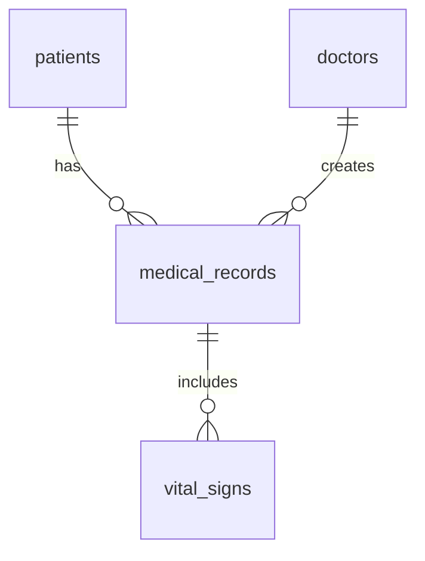

# โครงสร้างฐานข้อมูล MediTech HealthCheckup

## 1. ตารางหลัก

### 1.1 ระบบตรวจสุขภาพ (Checkup System)

#### checkup_jobs
| Column | Type | Description |
|--------|------|-------------|
| id | INTEGER | Primary Key |
| job_number | VARCHAR | รหัสงานตรวจสุขภาพ |
| company_name | VARCHAR | ชื่อบริษัท |
| branch_name | VARCHAR | ชื่อสาขา |
| start_date | TIMESTAMP | วันที่เริ่มต้น |
| end_date | TIMESTAMP | วันที่สิ้นสุด |
| status | VARCHAR | สถานะ |
| created_at | TIMESTAMP | วันที่สร้าง |
| updated_at | TIMESTAMP | วันที่แก้ไขล่าสุด |

#### checkup_job_tasks
| Column | Type | Description |
|--------|------|-------------|
| id | INTEGER | Primary Key |
| job_id | INTEGER | Foreign Key to checkup_jobs |
| task_name | VARCHAR | ชื่อรายการตรวจ |
| group_result_name | VARCHAR | ชื่อกลุ่มผลตรวจ |
| is_required | BOOLEAN | บังคับตรวจหรือไม่ |
| created_at | TIMESTAMP | วันที่สร้าง |
| updated_at | TIMESTAMP | วันที่แก้ไขล่าสุด |

#### checkup_results
| Column | Type | Description |
|--------|------|-------------|
| id | INTEGER | Primary Key |
| job_task_id | INTEGER | Foreign Key to checkup_job_tasks |
| patient_id | INTEGER | Foreign Key to patients |
| result_value | TEXT | ค่าผลตรวจ |
| result_status | VARCHAR | สถานะผลตรวจ (Normal/Abnormal) |
| doctor_comment | TEXT | ความเห็นแพทย์ |
| created_at | TIMESTAMP | วันที่สร้าง |
| updated_at | TIMESTAMP | วันที่แก้ไขล่าสุด |

### 1.2 ระบบบันทึกข้อมูลทางการแพทย์ (EMR)

#### patients
| Column | Type | Description |
|--------|------|-------------|
| id | INTEGER | Primary Key |
| hn | VARCHAR | Hospital Number |
| first_name | VARCHAR | ชื่อ |
| last_name | VARCHAR | นามสกุล |
| birth_date | DATE | วันเกิด |
| gender | VARCHAR | เพศ |
| created_at | TIMESTAMP | วันที่สร้าง |
| updated_at | TIMESTAMP | วันที่แก้ไขล่าสุด |

#### medical_records
| Column | Type | Description |
|--------|------|-------------|
| id | INTEGER | Primary Key |
| patient_id | INTEGER | Foreign Key to patients |
| visit_date | TIMESTAMP | วันที่เข้ารับบริการ |
| chief_complaint | TEXT | อาการสำคัญ |
| present_illness | TEXT | ประวัติการเจ็บป่วยปัจจุบัน |
| physical_exam | TEXT | การตรวจร่างกาย |
| diagnosis | TEXT | การวินิจฉัย |
| created_at | TIMESTAMP | วันที่สร้าง |
| updated_at | TIMESTAMP | วันที่แก้ไขล่าสุด |

#### vital_signs
| Column | Type | Description |
|--------|------|-------------|
| id | INTEGER | Primary Key |
| medical_record_id | INTEGER | Foreign Key to medical_records |
| temperature | DECIMAL | อุณหภูมิ |
| pulse_rate | INTEGER | อัตราการเต้นของหัวใจ |
| respiratory_rate | INTEGER | อัตราการหายใจ |
| blood_pressure_sys | INTEGER | ความดันโลหิตตัวบน |
| blood_pressure_dia | INTEGER | ความดันโลหิตตัวล่าง |
| created_at | TIMESTAMP | วันที่สร้าง |

## 2. ตารางอ้างอิง

### 2.1 ข้อมูลทั่วไป

#### insurance_companies
| Column | Type | Description |
|--------|------|-------------|
| id | INTEGER | Primary Key |
| company_name | VARCHAR | ชื่อบริษัทประกัน |
| contact_person | VARCHAR | ผู้ติดต่อ |
| phone | VARCHAR | เบอร์โทรศัพท์ |
| email | VARCHAR | อีเมล |
| created_at | TIMESTAMP | วันที่สร้าง |
| updated_at | TIMESTAMP | วันที่แก้ไขล่าสุด |

#### doctors
| Column | Type | Description |
|--------|------|-------------|
| id | INTEGER | Primary Key |
| first_name | VARCHAR | ชื่อ |
| last_name | VARCHAR | นามสกุล |
| specialty | VARCHAR | ความเชี่ยวชาญ |
| license_number | VARCHAR | เลขที่ใบประกอบวิชาชีพ |
| created_at | TIMESTAMP | วันที่สร้าง |
| updated_at | TIMESTAMP | วันที่แก้ไขล่าสุด |

## 3. ความสัมพันธ์ระหว่างตาราง

### 3.1 Checkup System


### 3.2 EMR System


## 4. Indexes

### 4.1 Performance Indexes
- `idx_checkup_jobs_number` on `checkup_jobs(job_number)`
- `idx_patients_hn` on `patients(hn)`
- `idx_medical_records_visit_date` on `medical_records(visit_date)`

### 4.2 Foreign Key Indexes
- `idx_checkup_results_job_task_id` on `checkup_results(job_task_id)`
- `idx_checkup_results_patient_id` on `checkup_results(patient_id)`
- `idx_medical_records_patient_id` on `medical_records(patient_id)`

## 5. Data Migration

### 5.1 Initial Data
```sql
-- ตัวอย่างข้อมูลเริ่มต้น
INSERT INTO insurance_companies (company_name, contact_person, phone, email)
VALUES ('Sample Insurance Co.', 'John Doe', '02-123-4567', 'john@sample.com');

INSERT INTO doctors (first_name, last_name, specialty, license_number)
VALUES ('สมชาย', 'ใจดี', 'อายุรแพทย์', 'MD12345');
```

### 5.2 Migration Scripts
```python
from alembic import op
import sqlalchemy as sa

def upgrade():
    # Create checkup_jobs table
    op.create_table(
        'checkup_jobs',
        sa.Column('id', sa.Integer(), nullable=False),
        sa.Column('job_number', sa.String(), nullable=False),
        sa.Column('company_name', sa.String(), nullable=False),
        sa.Column('start_date', sa.DateTime(), nullable=False),
        sa.PrimaryKeyConstraint('id')
    )
```

## 6. การบำรุงรักษาฐานข้อมูล

### 6.1 Backup Strategy
```bash
# Daily backup
pg_dump -U username -d dbname > backup_$(date +%Y%m%d).sql

# Keep last 30 days
find /backup -name "backup_*.sql" -mtime +30 -delete
```

### 6.2 Performance Monitoring
```sql
-- ตรวจสอบ Query ที่ใช้เวลานาน
SELECT 
    query,
    calls,
    total_time,
    rows,
    mean_time
FROM pg_stat_statements
ORDER BY total_time DESC
LIMIT 10;
```

## 7. Security

### 7.1 User Roles
```sql
-- สร้าง Role สำหรับแพทย์
CREATE ROLE doctor_role;
GRANT SELECT, INSERT, UPDATE ON medical_records TO doctor_role;
GRANT SELECT ON patients TO doctor_role;

-- สร้าง Role สำหรับพยาบาล
CREATE ROLE nurse_role;
GRANT SELECT, INSERT ON vital_signs TO nurse_role;
GRANT SELECT ON patients TO nurse_role;
```

### 7.2 Data Encryption
```python
from cryptography.fernet import Fernet

def encrypt_sensitive_data(data: str) -> str:
    key = Fernet.generate_key()
    f = Fernet(key)
    return f.encrypt(data.encode()).decode()
```

## 8. การ Query ข้อมูลที่ใช้บ่อย

### 8.1 รายงานผลตรวจสุขภาพ
```sql
SELECT 
    cj.job_number,
    cj.company_name,
    COUNT(CASE WHEN cr.result_status = 'Normal' THEN 1 END) as normal_count,
    COUNT(CASE WHEN cr.result_status = 'Abnormal' THEN 1 END) as abnormal_count
FROM checkup_jobs cj
JOIN checkup_job_tasks cjt ON cj.id = cjt.job_id
JOIN checkup_results cr ON cjt.id = cr.job_task_id
GROUP BY cj.id, cj.job_number, cj.company_name;
```

### 8.2 ประวัติการตรวจของผู้ป่วย
```sql
SELECT 
    p.hn,
    p.first_name,
    p.last_name,
    mr.visit_date,
    mr.chief_complaint,
    vs.temperature,
    vs.blood_pressure_sys,
    vs.blood_pressure_dia
FROM patients p
JOIN medical_records mr ON p.id = mr.patient_id
JOIN vital_signs vs ON mr.id = vs.medical_record_id
WHERE p.hn = :hn
ORDER BY mr.visit_date DESC; 